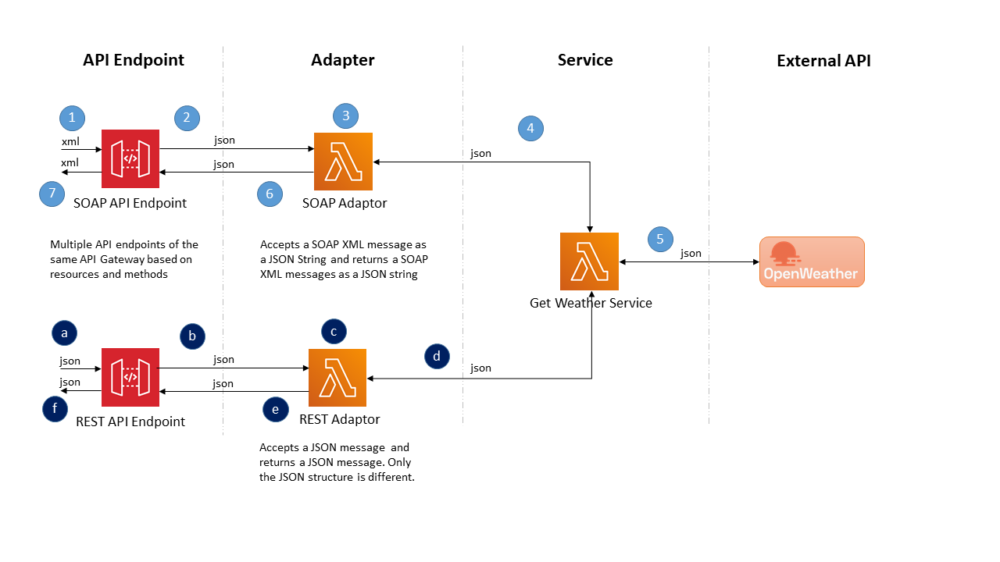

# aws serverless integration
This project hosts a set of AWS Lambda functions and uses other AWS Serverless technologies to simulate a set of message adaptors. These adaptors enable support for different message formats and protocols and routes messages to the same backend service after undergoing appropriate message transformations. 

## Architecture Diagram

------

## Communication Flow

1. A Soap request XML message arrives at the AWS API Gateway Soap endpoint. The message is set as a string into a JSON structure with **body** as key. This is performed using AWS API Gateway velocity templates.
2. The JSON message is forwarded to the AWS Lambda function **Soap Adaptor**.
3. **Soap Adaptor** lambda function parses the Soap request XML message string as a soap message, extracts the appropriate fields to invokes the **Get Weather Service** lambda function
4. The JSON message with the input payload transformed into the Get Weather Service API structure is forwaded to the AWS lambda function **Get Weather Service**
5. **Get Weather Service** invokes the [OpenWeatherMap API](https://openweathermap.org/api) with a JSON input and receives a JSON as output, transforms it into another JSON message and returns the message to the **Soap Adaptor**.
6. **Soap Adaptor** function parses the JSON, extracts the appropriate fields, forms the Soap response XML message, forms a JSON with the Soap XML response as string and returns the JSON message to the API Gateway.
7. API Gateway extracts the Soap response XML message and sends it to the client. The client receives an Soap response XML message.  

## Technology and Tool Stack

This project was developed using these technologies and tools:

1. Lambda Function Runtimes
   1. Java 11
   2. Node.js 12x
2. Windows 10
3. Docker Desktop
4. Visual Studio Code
5. GitHub
6. SoapUI - Testing tool to test the SOAP/REST API exposed by the AWS API Gateway
7. Typora - An excellent markdown document editor using which the README.md files are written.

## Troubleshooting Tips

This section lists some trouble shooting tips encountered during development. Please note these are specific to the development platform chosen.

1. While calling the API Gateway from SoapUI one error message appeared often - *{"message":"Missing Authentication Token"}*. This message is misleading since authentication was not enabled. This was owing to an incorrect/invalid API endpoint. 
2. While invoking the **Get Weather Service** lambda function from the **Rest Adaptor** function in local mode one error appeared now and then - *Security Signature Exception*. This message is confusing as no specific security signature was being used anywhere. On further analysis and going through the Docker Desktop GitHub issues this was resolved by restarting the Docker Desktop service whenever the issue appeared. Apparently a recent Docker Desktop update fixes the problem.
3. Visual Studio Code uses *PowerShell* as default terminal. I suggest replace it with *git bash* or *cmd* unless you are extremely comfortable with *PowerShell* and its commands.
